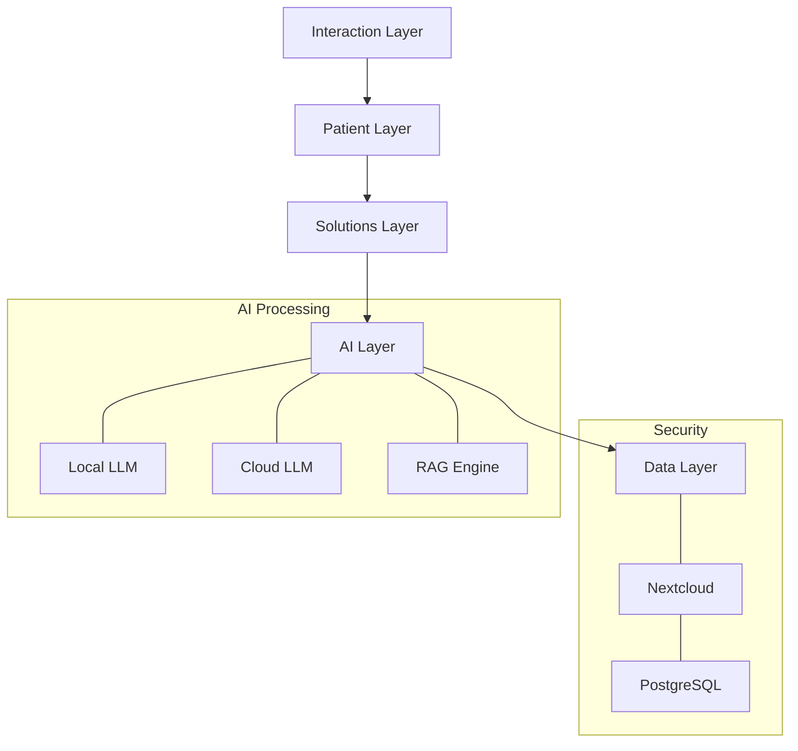

# Virtual Patient AI
https://communityhub.tec-connect.at/participations/442979

Virtual Patient AI evolves from the first clinically tested augmented reality image
guided surgery system (Medical University Vienna), transforming traditional teleconsultation into AI-powered patient care. The system utilizes MedlibreGPT (derived from PrivateGPT) to seamlessly integrate both cloud-based (OpenAI, Mistral) and locally-hosted LLMs with RAG-enhanced medical literature access.


# Virtual Patient AI

Medical AI platform evolving from clinically-tested AR surgery systems into AI-powered patient care. Built on MedlibreGPT technology with secure local and cloud LLM integration.

[Community Hub Project Link](https://communityhub.tec-connect.at/participations/442979)

## Core Components

### MedlibreGPT Engine
- Built on PrivateGPT foundation
- Integrated with Nextcloud for secure data management
- Hybrid model supporting both cloud (OpenAI, Mistral) and local LLM deployment
- RAG-enhanced medical literature processing

### AI-Twin Technology
- Physician-specific knowledge modeling
- Custom chatbot creation based on individual medical expertise
- Enhanced virtual consultation capabilities

### Security & Privacy
- On-premises Nextcloud storage
- Local LLM operation capability
- Domain-specific medical processing
- Network-independent operation option

## System Architecture



### 1. Interaction Layer
- Email/SMS communication
- QR + PIN authentication
- Encrypted data transmission
- Activity logging

### 2. Patient Layer
- Medlibre Copilot web widget
- Real-time assessment tools
- Structured data collection
- Natural language interface

### 3. Solutions Layer
- Nextcloud prompt management
- Dynamic AI response system
- Clinical protocol integration

### 4. AI Layer
- Local Mistral deployment
- GPT-4 cloud integration
- Medical literature RAG
- Parallel query processing

### 5. Data Layer
- PostgreSQL + Nextcloud integration
- HIPAA-compliant storage
- Flexible deployment options

## Technical Requirements

- Docker + Docker Compose
- PostgreSQL 13+
- Python 3.9+
- Node.js 16+
- Nextcloud server
- Optional: GPU for local LLM

## Quick Start Guide

```bash
git clone https://github.com/virtualpatient/virtualpatient-ai
cd virtualpatient-ai
docker-compose up -d
```

Detailed setup instructions in [docs/setup.md](docs/setup.md)

## Documentation

- [Setup Guide](docs/setup.md)
- [API Reference](docs/api.md)
- [Security Overview](docs/security.md)

## License

Apache License 2.0


## System Architecture

### 1. Interaction Layer
- **Communications Hub**
  - Email integration for detailed reports
  - SMS system for time-critical alerts
  - QR code + PIN authentication for patient onboarding
- **Security**
  - End-to-end encryption for all communications
  - Audit logging of all interactions

### 2. Patient Layer
- **Medlibre Copilot Interface**
  - Mobile-responsive web widget
  - Real-time symptom assessment
  - Structured data collection (Likert scales)
  - Natural language patient feedback

### 3. Solutions Layer
- **Prompt Engineering & Management**
  - Nextcloud-based prompt repository
  - Dynamic prompt modification system
  - Clinical protocol integration
  - Customizable response templates

### 4. AI Layer
- **Multi-Model Integration**
  - Local deployment: Mistral
  - Cloud integration: GPT-4
  - RAG implementation for medical literature
- **Processing Pipeline**
  - Parallel query processing
  - Context-aware response generation
  - Medical knowledge validation

### 5. Data Layer
- **Infrastructure**
  - PostgreSQL database integration
  - Nextcloud frontend for data access
  - HIPAA-compliant data handling
- **Deployment Options**
  - AWS/VM cloud deployment
  - On-premises installation
  - Hybrid setup support

## Technical Requirements

- Docker and Docker Compose
- PostgreSQL 13+
- Python 3.9+
- Node.js 16+
- Nextcloud server
- GPU support for local LLM hosting (optional)

# MedlibreGPT
We combine PrivateGPT with Nextcloud for secure medical data management.
## AI-Twin Chatbot
AI-Twin chatbots are custom-made to reflect the knowledge and experience of individual physicians, enhancing the virtual consultation experience.
## Private Cloud
 Storage Leverages Nextcloud for secure, on-premises storage of patient data.
## Local Large Language Model (LLM)
We integrate LLMs with Nextcloud for superior data processing.
## Domain-Specific Medical LLM
 MedlibreGPT focuses on narrow medical fields, offering insights surpassing general AI models like ChatGPT.
## Private LLM
Functions independently from online networks, prioritizing security, data privacy, and minimizing external risks.
